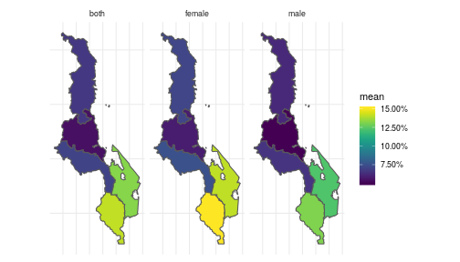
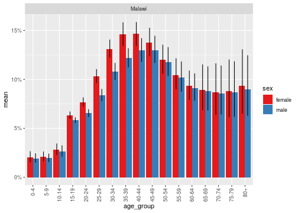
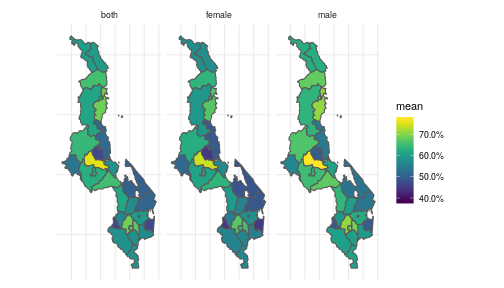
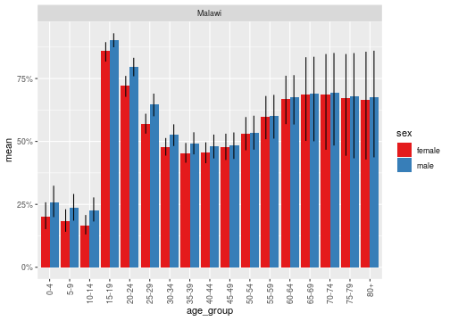
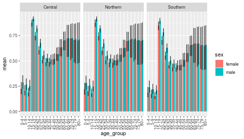
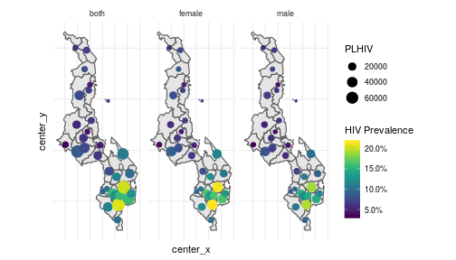

```r
library(naomi)
library(tidyverse)
library(sf)
```

# 0. Prepare webtool GeoJSON input

The MVP version of Naomi web tool allows upload of a single GeoJSON file for
specifying the area hierarchy. This preprocessing step joins the area tables
into a single long format dataset and saves as a GeoJSON for upload to the
web tool.


```r

area_levels <- read_csv(system.file("extdata/areas/area_levels.csv", package = "naomi"))
area_hierarchy  <- read_csv(system.file("extdata/areas/area_hierarchy.csv", package = "naomi"))
area_boundaries <- sf::read_sf(system.file("extdata/areas/area_boundaries.geojson", package = "naomi"))

area_long <- area_hierarchy %>%
  left_join(
    area_levels %>% select(area_level, area_level_label, display, naomi_level)
  ) %>%
  left_join(
    area_boundaries
  )
```

```r
st_write(area_long, file.path(tempdir(), "area_long.geojson"), delete_dsn = TRUE)
#> Deleting source `/tmp/RtmpeqMYnh/area_long.geojson' failed
#> Writing layer `area_long' to data source `/tmp/RtmpeqMYnh/area_long.geojson' using driver `GeoJSON'
#> Writing 69 features with 10 fields and geometry type Multi Polygon.
```

# 1. (Up)Load data inputs

Area hierarchy and boundaries


```r
area_long <- read_sf(file.path(tempdir(), "area_long.geojson"))

areas <- create_areas(area_levels, area_hierarchy, area_boundaries)
```

Population data


```r
pop_agesex <- read_csv(system.file("extdata/population/population_agesex.csv", package = "naomi"))
```

Survey data


```r
survey_hiv_indicators <- read_csv(system.file("extdata/survey/survey_hiv_indicators.csv", package = "naomi"))
```

Programme data


```r
art_number <- read_csv(system.file("extdata/programme/art_number.csv", package = "naomi"))
anc_testing <- read_csv(system.file("extdata/programme/anc_testing.csv", package = "naomi"))
```

Programme data

Spectrum PJNZ


```r
pjnz <- system.file("extdata/mwi2019.PJNZ", package = "naomi")
spec <- extract_pjnz_naomi(pjnz)
```

# 2. Choose model areas and time points

The following are required to be provided to define the model state space:

* `scope`: A collection of `area_id`s defining the set of areas to be modelled.
   Usually this is simply national level, so the level 0 `area_id`.
* `level`: Area level at which to fit model.
* `quarter_id_t1`: The first time point for the model--approximately the midpoint
  of the household survey data used.
* `quarter_id_t2`: The second time point for the model--the current time for which
   estimates are needed.


```r
scope <- "MWI"
level <- 4
quarter_id_t1 <- convert_quarter_id(1, 2016)
quarter_id_t2 <- convert_quarter_id(3, 2018)
```

The following select data inputs to model fitting from the uploaded datasets.
Providing `NULL` for any will exclude that data source from model fitting.

* Multiple household survey may be used in fitting, but they must be rougly
  contemporaneous around `quarter_id_t1`.
* Only survey ART coverage or survey VLS should be included from a given survey,
  not both. ART coverage is preferred if both are available.
* `artnum_quarter_id_t1` and `artnum_quarter_id_t1` are the time point at
  which current on ART programme data will be used to estimte ART coverage.
  They are typically the same `quarter_id_t1` and `quarter_id_t2` if ART
  programme data are used.
* `anc_quarter_id_t1` and `anc_quarter_id_t2` are typically a range of 3-4 quarters.    Data will be aggregated over these quarters for a larger sample size. They
  will typically be consecutive quarters, though a quarter could be dropped for
  example if there were reporting problems known to affect a given quarter.
Survey IDs to include in fitting


```r
prev_survey_ids  <- c("MWI2016PHIA", "MWI2015DHS")
artcov_survey_ids  <- "MWI2016PHIA"
vls_survey_ids <- NULL
recent_survey_ids <- "MWI2016PHIA"

artnum_quarter_id_t1 <- convert_quarter_id(1, 2016)
artnum_quarter_id_t2 <- convert_quarter_id(3, 2018)

anc_quarter_id_t1 <- convert_quarter_id(c(4, 1, 2, 3), c(2015, 2016, 2016, 2016))
anc_quarter_id_t2 <- convert_quarter_id(1:4, 2018)
```

# 3. Review input data

# 4. Prepare model inputs
Setup the model


```r
naomi_mf <- naomi_model_frame(areas,
                              pop_agesex,
                              spec,
                              scope = scope,
                              level = level,
                              quarter_id_t1,
                              quarter_id_t2)
```

Prepare data inputs


```r
prev_dat <- survey_prevalence_mf(prev_survey_ids, survey_hiv_indicators, naomi_mf)
artcov_dat <- survey_artcov_mf(artcov_survey_ids, survey_hiv_indicators, naomi_mf)
recent_dat <- survey_recent_mf(recent_survey_ids, survey_hiv_indicators, naomi_mf)
#> Joining, by = "age_group_id"

anc_prev_t1_dat <- anc_testing_prev_mf(anc_quarter_id_t1, anc_testing, naomi_mf)
anc_artcov_t1_dat <- anc_testing_artcov_mf(anc_quarter_id_t1, anc_testing, naomi_mf)

anc_prev_t2_dat <- anc_testing_prev_mf(anc_quarter_id_t2, anc_testing, naomi_mf)
anc_artcov_t2_dat <- anc_testing_artcov_mf(anc_quarter_id_t2, anc_testing, naomi_mf)

artnum_t1_dat <- artnum_mf(artnum_quarter_id_t1, art_number, naomi_mf)
artnum_t2_dat <- artnum_mf(artnum_quarter_id_t2, art_number, naomi_mf)
```

5. Fit model
Prepare model inputs and initial parameters


```r
tmb_inputs <- prepare_tmb_inputs(naomi_mf, prev_dat, artcov_dat, recent_dat,
                                 anc_prev_t1_dat,
                                 anc_prev_t2_dat,
                                 anc_artcov_t1_dat,
                                 anc_artcov_t2_dat,
                                 artnum_t1_dat,
                                 artnum_t2_dat)
```

Fit the TMB model


```r
fit <- fit_tmb(tmb_inputs)
#>   0:     819343.98:  0.00000  0.00000  0.00000  0.00000  0.00000  0.00000  0.00000  0.00000  0.00000  0.00000  0.00000  0.00000  0.00000  0.00000  0.00000  0.00000  0.00000  0.00000  0.00000  0.00000  0.00000
#>   1:     819267.00: 0.147193 -1.61930 0.163542 -1.88396 0.203892 -0.543050 0.0548338 -0.848243 0.114778 -1.22929 0.121159 -1.47212 0.204682 0.0288302 0.0573018 -0.708658 -0.000134455 7.90430e-05 -0.300419 -1.64343 -1.29447
#>   2:     819235.50: 0.0816504 0.0552678 0.339785 -3.96829 0.671900 -0.924206 0.183563 -1.85982 0.133508 -1.32305 0.224128 -2.79820 0.492465 0.0995459 0.180450 -1.48606 -0.000308742 0.000195590 -0.646270 0.514978 -0.909901
#>   3:     819194.13: 0.168808 -0.709132 0.351823 -4.16044  1.22685 -0.308707 0.289045 -2.19939 0.0733740 -0.465795 0.236212 -2.95481 0.641783 0.0667734 0.289208 -1.57152 -0.000381011 0.000270100 -0.728612 -0.284051 -0.577144
#>   4:     819180.76: 0.201425 -0.988619 0.349411 -4.14875  1.35001 -0.481570 0.325083 -2.26376 0.100902 -0.774999 0.236616 -2.97124 0.684936 0.00770694 0.330372 -1.59888 -0.000404221 0.000295042 -0.745954 -0.788203 -0.670022
#>   5:     819178.90: 0.213178 -0.932734 0.345908 -4.13182  1.53400 -0.633204 0.379992 -2.33953 0.107611 -0.861817 0.237566 -2.99678 0.740732 -0.0112113 0.390975 -1.64055 -0.000437682 0.000330129 -0.769952 -0.973494 -0.721844
#>   6:     819177.97: 0.236645 -1.00438 0.341675 -4.11206  1.73101 -0.657421 0.445608 -2.40401 0.103449 -0.831241 0.238690 -3.02469 0.797269 0.00239415 0.460884 -1.68742 -0.000475241 0.000367922 -0.795358 -0.735089 -0.706550
#>   7:     819176.16: 0.254168 -0.942809 0.335652 -4.08326  1.95342 -0.630539 0.536176 -2.46160 0.107346 -0.907156 0.239633 -3.05553 0.866381 0.0128852 0.556109 -1.74443 -0.000524555 0.000414885 -0.825752 -0.914641 -0.716639
#>   8:     819175.58: 0.281223 -0.987331 0.329085 -4.05645  2.16139 -0.593156 0.636673 -2.51078 0.0910831 -0.749701 0.240828 -3.08969 0.934290 0.0208644 0.660342 -1.78777 -0.000576735 0.000460605 -0.855838 -0.782393 -0.751147
#>   9:     819174.43: 0.307553 -0.961683 0.320403 -4.02641  2.34609 -0.512513 0.769221 -2.53170 0.0976606 -0.873768 0.241820 -3.12436  1.00457 0.0223467 0.796140 -1.82595 -0.000641210 0.000508743 -0.887714 -0.830520 -0.616599
#>  10:     819173.93: 0.313324 -0.948055 0.318159 -4.01886  2.39925 -0.517574 0.801311 -2.53987 0.0930460 -0.823937 0.241898 -3.13277  1.01917 0.0296149 0.829450 -1.83155 -0.000656649 0.000519165 -0.895013 -0.903811 -0.729312
#>  11:     819173.63: 0.327607 -0.963583 0.313756 -4.00437  2.48871 -0.501159 0.862602 -2.55115 0.0955916 -0.872665 0.242112 -3.14579  1.04655 0.0395833 0.892868 -1.84196 -0.000685739 0.000538072 -0.908387 -0.850142 -0.675274
#>  12:     819172.96: 0.356612 -0.924800 0.300656 -3.97085  2.61473 -0.401282  1.03875 -2.51809 0.0922724 -0.892954 0.241650 -3.17176  1.09900 0.0544226  1.07426 -1.83494 -0.000762653 0.000572333 -0.934675 -0.870817 -0.750135
#>  13:     819172.81: 0.384903 -1.01282 0.291285 -3.94924  2.78547 -0.495548  1.15900 -2.52009 0.0777016 -0.776832 0.241725 -3.18957  1.13876 0.0707668  1.19960 -1.82505 -0.000815254 0.000595757 -0.953719 -0.914738 -0.651166
#>  14:     819172.09: 0.401045 -0.888500 0.277246 -3.92846  2.85170 -0.385684  1.33238 -2.47541 0.0733085 -0.794096 0.240694 -3.20596  1.17990 0.0569992  1.38176 -1.78701 -0.000885240 0.000610129 -0.971255 -0.894629 -0.703064
#>  15:     819171.89: 0.437898 -1.00047 0.262524 -3.90829  2.93176 -0.349638  1.48642 -2.44113 0.0795569 -0.929855 0.238853 -3.21318  1.20247 0.0922252  1.55533 -1.75726 -0.000947434 0.000618453 -0.985730 -0.890324 -0.785024
#>  16:     819171.28: 0.457059 -0.960388 0.244606 -3.89660  3.02563 -0.301911  1.65994 -2.38273 0.0646232 -0.856644 0.237084 -3.22092  1.22304 0.133293  1.75961 -1.71185 -0.00101640 0.000621037 -0.999406 -0.877991 -0.704836
#>  17:     819171.20: 0.455513 -0.923039 0.242565 -3.89482  3.04860 -0.295580  1.67611 -2.38258 0.0631139 -0.847415 0.236883 -3.22213  1.23979 0.0935988  1.77857 -1.70572 -0.00102272 0.000622479 -1.00123 -0.889908 -0.717797
#>  18:     819171.16: 0.462253 -0.965242 0.239559 -3.89216  3.07920 -0.282495  1.69852 -2.38042 0.0628328 -0.856297 0.236599 -3.22348  1.24733 0.0893868  1.80655 -1.69960 -0.00103163 0.000624381 -1.00372 -0.874079 -0.703664
#>  19:     819171.08: 0.462776 -0.933681 0.235684 -3.89020  3.10708 -0.275572  1.72882 -2.36928 0.0604971 -0.847173 0.236145 -3.22465  1.25106 0.0936729  1.84422 -1.68851 -0.00104313 0.000624820 -1.00586 -0.889597 -0.713508
#>  20:     819170.97: 0.472705 -0.958774 0.226444 -3.88564  3.17246 -0.245431  1.79587 -2.34632 0.0577025 -0.855623 0.235077 -3.22696  1.26180 0.0974881  1.92976 -1.66430 -0.00106842 0.000626091 -1.01083 -0.871613 -0.706376
#>  21:     819170.61: 0.516477 -0.971217 0.162680 -3.87716  3.46803 -0.193130  2.23738 -2.13737 0.0294396 -0.843308 0.226667 -3.23000  1.29997 0.107335  2.49425 -1.46685 -0.00121980 0.000612688 -1.02951 -0.916225 -0.704048
#>  22:     819170.45: 0.532051 -0.939085 0.0856374 -3.89259  3.71072 0.0122097  2.67688 -2.10032 -0.00722878 -0.787516 0.215494 -3.21526  1.33800 0.0452013  3.05736 -1.21195 -0.00132242 0.000588244 -1.03787 -0.869816 -0.709127
#>  23:     819170.36: 0.524481 -0.919070 0.0573304 -3.89641  3.82339 0.0782343  2.75151 -2.00002 -0.00775759 -0.904305 0.211326 -3.21187  1.28879 0.162062  3.25435 -1.17975 -0.00132585 0.000590336 -1.03676 -0.899417 -0.695927
#>  24:     819170.22: 0.522931 -0.935420 0.0546247 -3.89605  3.85102 0.0635752  2.73507 -1.95746 -0.0124375 -0.850228 0.211197 -3.21635  1.30016 0.113309  3.26694 -1.18181 -0.00131442 0.000596099 -1.03594 -0.871365 -0.727898
#>  25:     819170.21: 0.521842 -0.931893 0.0541678 -3.89555  3.85456 0.0606809  2.73602 -1.95977 -0.0116503 -0.861187 0.211181 -3.21662  1.30233 0.102911  3.26568 -1.17566 -0.00131146 0.000597304 -1.03569 -0.890813 -0.705557
#>  26:     819170.20: 0.518753 -0.934236 0.0505434 -3.89342  3.86760 0.0643263  2.74352 -1.96158 -0.0127021 -0.855440 0.210824 -3.21942  1.29659 0.0990876  3.27175 -1.14896 -0.00129724 0.000602964 -1.03445 -0.883838 -0.710656
#>  27:     819170.20: 0.515493 -0.933939 0.0454987 -3.89124  3.88156 0.0761824  2.74902 -1.94984 -0.0138078 -0.854008 0.210241 -3.22204  1.29052 0.0966501  3.29378 -1.13865 -0.00128202 0.000608390 -1.03350 -0.885030 -0.711080
#>  28:     819170.19: 0.503230 -0.932385 0.0274468 -3.88655  3.94026 0.103906  2.78024 -1.94481 -0.0164123 -0.855697 0.207728 -3.22383  1.26330 0.0950667  3.36811 -1.10299 -0.00122879 0.000615863 -1.02834 -0.887940 -0.711367
#>  29:     819170.19: 0.492925 -0.932042 0.00715141 -3.88484  3.99827 0.126484  2.80074 -1.92639 -0.0190617 -0.856387 0.204691 -3.22329  1.24495 0.0771847  3.44963 -1.07515 -0.00117705 0.000619535 -1.02467 -0.881366 -0.709102
#>  30:     819170.19: 0.504269 -0.938221 -0.00325836 -3.88452  4.00050 0.130080  2.79952 -1.92818 -0.0194727 -0.853009 0.203119 -3.22711  1.26456 0.0851489  3.47404 -1.05255 -0.00118514 0.000627300 -1.03459 -0.887072 -0.709609
#>  31:     819170.19: 0.507072 -0.935370 -0.00253677 -3.88860  3.99738 0.126083  2.78211 -1.93070 -0.0174578 -0.855671 0.202981 -3.22547  1.27125 0.0937624  3.46221 -1.05540 -0.00121306 0.000610145 -1.03143 -0.883952 -0.711396
#>  32:     819170.19: 0.504817 -0.935187 -0.00441364 -3.88706  3.99061 0.125018  2.78078 -1.94247 -0.0169422 -0.854321 0.202514 -3.22440  1.26704 0.0887600  3.46968 -1.06504 -0.00121781 0.000610927 -1.02801 -0.884284 -0.710682
#>  33:     819170.19: 0.503274 -0.935498 -0.00718231 -3.88549  3.99287 0.125364  2.77283 -1.94049 -0.0164128 -0.855125 0.202123 -3.22654  1.26364 0.0852205  3.46978 -1.05398 -0.00120694 0.000626963 -1.03137 -0.885998 -0.708850
#>  34:     819170.19: 0.504290 -0.936253 -0.00931705 -3.88632  3.99439 0.125702  2.76943 -1.94120 -0.0162219 -0.854283 0.201689 -3.22597  1.26486 0.0879680  3.47577 -1.05449 -0.00120468 0.000620737 -1.03227 -0.885163 -0.710375
#>  35:     819170.19: 0.504889 -0.935630 -0.0103469 -3.88722  3.99222 0.125180  2.76522 -1.94456 -0.0157680 -0.854604 0.201404 -3.22528  1.26673 0.0884696  3.47676 -1.05463 -0.00120978 0.000613674 -1.03028 -0.884891 -0.710244
```

Calculate model outputs. We can calculate outputs based on posterior mode
estimates before running `report_tmb()` to calculate posterior intervals.


```r
outputs <- output_package(fit, naomi_mf, areas)
```

The output package consists of a data frame of indicators and metadata
defining the labels for each indicator.


```r
names(outputs)
#> [1] "indicators"     "meta_area"      "meta_age_group" "meta_period"   
#> [5] "meta_indicator"
```

If uncertainty has not been calcualted yet, the output object retures values
for `mode`, but not `mean` or `lower` and `upper` 95% uncertainty ranges.


```r
outputs$indicators %>%
  dplyr::filter(
    indicator_id == 2L,  # HIV prevalence
    age_group_id == 18   # Age group 15-49
  ) %>%
  head()
#> # A tibble: 6 x 11
#>   area_id sex   age_group_id quarter_id indicator_id   mode  mean    se
#>   <chr>   <chr>        <int>      <int>        <dbl>  <dbl> <dbl> <dbl>
#> 1 MWI     both            18        465            2 0.0959    NA    NA
#> 2 MWI     fema…           18        465            2 0.103     NA    NA
#> 3 MWI     male            18        465            2 0.0886    NA    NA
#> 4 MWI.1   both            18        465            2 0.0663    NA    NA
#> 5 MWI.1   fema…           18        465            2 0.0711    NA    NA
#> 6 MWI.1   male            18        465            2 0.0613    NA    NA
#> # … with 3 more variables: median <dbl>, lower <dbl>, upper <dbl>
```

The function `add_output_labels()` returns the indicators table
with labels added as additional columns.


```r
add_output_labels(outputs) %>%
  dplyr::filter(
    indicator_id == 2L,  # HIV prevalence
    age_group_id == 18   # Age group 15-49
  ) %>%
  head()
#> # A tibble: 6 x 17
#>   area_level area_level_label area_id area_name sex   age_group_id
#>        <dbl> <chr>            <chr>   <chr>     <chr>        <int>
#> 1          0 Country          MWI     Malawi    both            18
#> 2          0 Country          MWI     Malawi    fema…           18
#> 3          0 Country          MWI     Malawi    male            18
#> 4          1 Region           MWI.1   Northern  both            18
#> 5          1 Region           MWI.1   Northern  fema…           18
#> 6          1 Region           MWI.1   Northern  male            18
#> # … with 11 more variables: age_group_label <chr>, quarter_id <int>,
#> #   quarter_label <chr>, indicator_id <dbl>, indicator_label <chr>,
#> #   mode <dbl>, mean <dbl>, se <dbl>, median <dbl>, lower <dbl>,
#> #   upper <dbl>
```

Calculate uncertainty ranges and add to the output object
(This is time consuming and memory intensive.


```r
system.time(fit <- sample_tmb(fit))
#> [1] "Simulating outputs"
#> [1] "Returning sample"
#>    user  system elapsed 
#>  73.015   0.168  73.196
```

Regenerate outputs with uncertainty ranges.


```r
system.time(outputs <- output_package(fit, naomi_mf, areas))
#>    user  system elapsed 
#>   4.509   0.036   4.545

outputs$indicators %>%
  dplyr::filter(
    indicator_id == 2L,  # HIV prevalence
    age_group_id == 18   # Age group 15-49
  ) %>%
  head()
#> # A tibble: 6 x 11
#>   area_id sex   age_group_id quarter_id indicator_id   mode   mean      se
#>   <chr>   <chr>        <int>      <int>        <dbl>  <dbl>  <dbl>   <dbl>
#> 1 MWI     both            18        465            2 0.0959 0.0960 0.00119
#> 2 MWI     fema…           18        465            2 0.103  0.103  0.00168
#> 3 MWI     male            18        465            2 0.0886 0.0887 0.00163
#> 4 MWI.1   both            18        465            2 0.0663 0.0665 0.00121
#> 5 MWI.1   fema…           18        465            2 0.0711 0.0712 0.00161
#> 6 MWI.1   male            18        465            2 0.0613 0.0615 0.00147
#> # … with 3 more variables: median <dbl>, lower <dbl>, upper <dbl>
```

Save model outputs to ZIP


```r
dir.create("outputs", showWarnings = FALSE)
save_output_package(outputs, "mwi_outputs", "outputs", with_labels = FALSE)
save_output_package(outputs, "mwi_outputs_with_labels", "outputs", with_labels = TRUE)
save_output_package(outputs, "mwi_outputs_single_csv", "outputs", with_labels = TRUE, single_csv = TRUE)
save_output_package(outputs, "mwi_outputs_single_csv_unlabelled", "outputs", with_labels = FALSE, single_csv = TRUE)


## #' 6. Plot some model outputs

indicators <- add_output_labels(outputs) %>%
  left_join(outputs$meta_area %>% select(area_level, area_id, center_x, center_y)) %>%
  sf::st_as_sf()
```

15-49 prevalence by district


```r
indicators %>%
  filter(age_group_id == 18,
         indicator_id == 2L,
         area_level == 4) %>%
  ggplot(aes(fill = mode)) +
  geom_sf() +
  viridis::scale_fill_viridis(labels = scales::percent_format()) +
  th_map() +
  facet_wrap(~sex)
```


15-49 prevalence by Zone


```r
indicators %>%
  filter(age_group_id == 18,
         ## sex == "both",
         indicator_id == 2L,
         area_level == 2) %>%
  ## semi_join(get_area_collection(areas, level = 3, area_scope = "MWI.3")) %>%
  ggplot(aes(fill = mean)) +
  geom_sf() +
  viridis::scale_fill_viridis(labels = scales::percent_format()) +
  th_map() +
  facet_wrap(~sex)
```



Age-specific prevalence, national


```r
indicators %>%
  dplyr::filter(area_level == 0,
         sex != "both",
         age_group_id %in% 1:17,
         indicator_id == 2L) %>%
  left_join(get_age_groups()) %>%
  mutate(age_group = fct_reorder(age_group_label, age_group_id)) %>%
  ggplot(aes(age_group, mean, ymin = lower, ymax = upper, fill = sex)) +
  geom_col(position = "dodge") +
  geom_linerange(position = position_dodge(0.8)) +
  scale_fill_brewer(palette = "Set1") +
  scale_y_continuous(labels = scales::percent_format(1)) +
  facet_wrap(~area_name) +
  theme(axis.text.x = element_text(angle = 90, hjust = 1.0, vjust = 0.5))
#> Joining, by = c("age_group_id", "age_group_label")
```



15-64 ART coverage by district


```r
indicators %>%
  filter(age_group_id == 19,
         area_level == 4,
         indicator_id == 4L) %>%
  ggplot(aes(fill = mean)) +
  geom_sf() +
  viridis::scale_fill_viridis(labels = scales::percent_format()) +
  th_map() +
  facet_wrap(~sex)
```



Age-specific ART coverage, national


```r
indicators %>%
  dplyr::filter(area_level == 0,
         sex != "both",
         age_group_id %in% 1:17,
         indicator_id == 4L) %>%
  left_join(get_age_groups()) %>%
  mutate(age_group = fct_reorder(age_group_label, age_group_id)) %>%
  ggplot(aes(age_group, mean, ymin = lower, ymax = upper, fill = sex)) +
  geom_col(position = "dodge") +
  geom_linerange(position = position_dodge(0.8)) +
  scale_fill_brewer(palette = "Set1") +
  scale_y_continuous(labels = scales::percent_format(1)) +
  facet_wrap(~area_name) +
  theme(axis.text.x = element_text(angle = 90, hjust = 1.0, vjust = 0.5))
#> Joining, by = c("age_group_id", "age_group_label")
```



ART coverage by age/sex and region


```r
indicators %>%
  filter(area_level == 1,
         sex != "both",
         age_group_id %in% 1:17,
         indicator_id == 4L) %>%
  left_join(get_age_groups()) %>%
  mutate(age_group = fct_reorder(age_group_label, age_group_id)) %>%
  ggplot(aes(age_group, mean, ymin = lower, ymax = upper, fill = sex)) +
  geom_col(position = "dodge") +
  geom_linerange(position = position_dodge(0.8)) +
  facet_wrap(~area_name) +
  theme(axis.text.x = element_text(angle = 90, hjust = 1.0, vjust = 0.5))
#> Joining, by = c("age_group_id", "age_group_label")
```



Bubble plot prevalence and PLHIV


```r
indicators %>%
  filter(age_group_id == 19,
         area_level == 4,
         indicator_id %in% 2:3) %>%
  select(sex, center_x, center_y, indicator_label, mean) %>%
  spread(indicator_label, mean) %>%
  ggplot() +
  geom_sf() +
  geom_point(aes(center_x, center_y, colour = `HIV Prevalence`, size = PLHIV)) +
  viridis::scale_color_viridis(labels = scales::percent_format()) +
  th_map() +
  facet_wrap(~sex)
```



