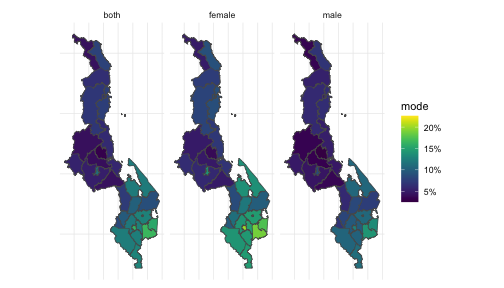
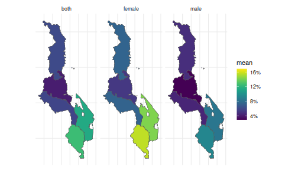
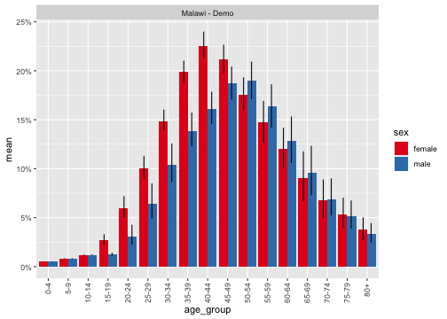
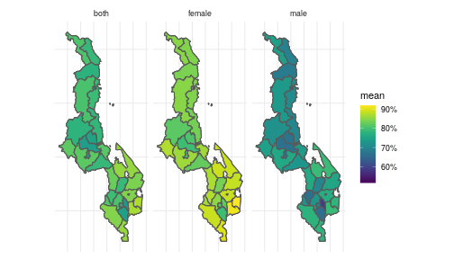
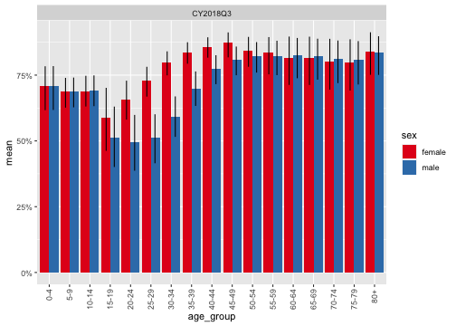
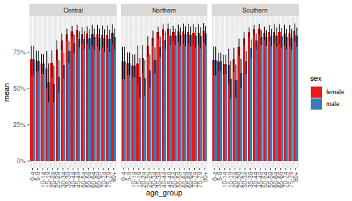

```r
library(naomi)
library(tidyverse)
library(sf)
```

# 0. Prepare webtool GeoJSON input

The MVP version of Naomi web tool allows upload of a single GeoJSON file for
specifying the area hierarchy. This preprocessing step joins the area tables
into a single long format dataset and saves as a GeoJSON for upload to the
web tool.


# 1. (Up)Load data inputs

Area hierarchy and boundaries


```r
area_merged <- read_sf(system.file("extdata/demo_areas.geojson", package = "naomi"))
```

Population data


```r
pop_agesex <- read_csv(system.file("extdata/demo_population_agesex.csv", package = "naomi"))
```

Survey data


```r
survey_hiv_indicators <- read_csv(system.file("extdata/demo_survey_hiv_indicators.csv", package = "naomi"))
```

Programme data


```r
art_number <- read_csv(system.file("extdata/demo_art_number.csv", package = "naomi"))
anc_testing <- read_csv(system.file("extdata/demo_anc_testing.csv", package = "naomi"))
```

Programme data

Spectrum PJNZ


```r
pjnz <- system.file("extdata/demo_mwi2019.PJNZ", package = "naomi")
spec <- extract_pjnz_naomi(pjnz)
```

# 2. Choose model areas and time points

The following are required to be provided to define the model state space:

* `scope`: A collection of `area_id`s defining the set of areas to be modelled.
   Usually this is simply national level, so the level 0 `area_id`.
* `level`: Area level at which to fit model.
* `quarter_id_t1`: The first time point for the model--approximately the midpoint
  of the household survey data used.
* `quarter_id_t2`: The second time point for the model--the current time for which
   estimates are needed.
* `quarter_id_t3`: The third time point for the model--the future projection for HIV
   estimates.


```r
scope <- "MWI"
level <- 4
calendar_quarter_t1 <- "CY2016Q1"
calendar_quarter_t2 <- "CY2018Q3"
calendar_quarter_t3 <- "CY2019Q4"
```

The following select data inputs to model fitting from the uploaded datasets.
Providing `NULL` for any will exclude that data source from model fitting.

* Multiple household survey may be used in fitting, but they must be rougly
  contemporaneous around `quarter_id_t1`.
* Only survey ART coverage or survey VLS should be included from a given survey,
  not both. ART coverage is preferred if both are available.
* `artnum_quarter_id_t1` and `artnum_quarter_id_t1` are the time point at
  which current on ART programme data will be used to estimte ART coverage.
  They are typically the same `quarter_id_t1` and `quarter_id_t2` if ART
  programme data are used.
* `anc_quarter_id_t1` and `anc_quarter_id_t2` are typically a range of 3-4 quarters.    Data will be aggregated over these quarters for a larger sample size. They
  will typically be consecutive quarters, though a quarter could be dropped for
  example if there were reporting problems known to affect a given quarter.
Survey IDs to include in fitting


```r
prev_survey_ids  <- c("DEMO2016PHIA", "DEMO2015DHS")
artcov_survey_ids  <- "DEMO2016PHIA"
vls_survey_ids <- NULL
recent_survey_ids <- "DEMO2016PHIA"

artnum_calendar_quarter_t1 <- "CY2016Q1"
artnum_calendar_quarter_t2 <- "CY2018Q3"

anc_clients_year2 <- 2018
anc_clients_year2_num_months <- 9

anc_prevalence_year1 <- 2016
anc_prevalence_year2 <- 2018

anc_art_coverage_year1 <- 2016
anc_art_coverage_year2 <- 2018
```

# 3. Review input data

# 4. Prepare model inputs
Setup the model


```r
naomi_mf <- naomi_model_frame(area_merged,
                              pop_agesex,
                              spec,
                              scope = scope,
                              level = level,
                              calendar_quarter_t1,
                              calendar_quarter_t2,
                              calendar_quarter_t3)
```

Prepare data inputs


```r
naomi_data <- select_naomi_data(naomi_mf,
                                survey_hiv_indicators,
                                anc_testing,
                                art_number,
                                prev_survey_ids,
                                artcov_survey_ids,
                                recent_survey_ids,
                                vls_survey_ids,
                                artnum_calendar_quarter_t1,
                                artnum_calendar_quarter_t2,
                                anc_prevalence_year1,
                                anc_prevalence_year2,
                                anc_art_coverage_year1,
                                anc_art_coverage_year2)
```

5. Fit model
Prepare model inputs and initial parameters


```r
tmb_inputs <- prepare_tmb_inputs(naomi_data)
```

Fit the TMB model


```r
fit <- fit_tmb(tmb_inputs)
#>   0:     5044.6435:  0.00000 0.916291  0.00000 0.916291  0.00000 0.916291  2.58200 0.916291 -0.693147  0.00000 0.916291  0.00000 0.916291  0.00000 0.916291  2.58200 0.916291 0.916291 0.916291 0.916291  0.00000  0.00000  0.00000 -0.693147 0.916291 0.916291 0.916291 0.916291 0.916291 0.916291
#>   1:     4718.2401: 0.102104 -0.277378 0.106313 -0.346451 0.0959817 0.605789  2.71841 0.570737 -0.693147 0.0869975 -0.139898 0.0757006 -0.0439938 0.0383274 0.469446  2.66560 0.681799 -0.108708 -0.217260 -0.147586 0.0152858 0.000608564 -0.297008 -1.75598 -0.359159 -0.234783 -0.377829 -0.0607581 0.549393 0.916291
#>   2:     4536.5945: 0.171715 -0.908226 0.222864 -1.73034 0.309508 0.371577  2.88605 0.176383 -0.693147 0.176493 -1.25119 0.149605 -0.965573 0.122804 -0.0458188  2.75526 0.440047 -1.14582 -1.25450 -1.34306 0.0290446 0.00106901 -0.806478 -1.22408 -1.75536 -1.34741 -2.02764 -0.973678 0.263750 0.916291
#>   3:     4516.5973: 0.150766 -0.451559 0.233584 -1.88128 0.423093 0.327143  2.93374 0.0696739 -0.693147 0.190409 -1.44460 0.170925 -1.21684 0.185843 -0.177630  2.78228 0.369285 -1.27483 -1.46360 -1.65162 0.0265142 0.00107495 -0.934666 -1.61733 -1.70318 -1.51764 -2.17708 -1.06033 0.311859 0.916291
#>   4:     4505.3198: 0.198961 -0.820169 0.246244 -2.06583 0.626263 0.244886  3.00218 -0.0817229 -0.693147 0.205657 -1.69493 0.196287 -1.49304 0.316633 -0.357516  2.82438 0.259138 -1.37776 -1.72848 -2.03305 0.0180307 0.00102736 -1.08664 -1.62993 -1.63599 -1.75304 -2.27554 -1.14966 0.284142 0.916291
#>   5:     4499.7002: 0.203603 -0.403248 0.250498 -2.06347  1.00437 0.0867395  3.07277 -0.235538 -0.693147 0.213589 -1.88266 0.207662 -1.55168 0.616741 -0.516800  2.88331 0.102089 -1.30180 -1.89843 -2.35695 -0.0108732 0.000797404 -1.11781 -1.51885 -1.69945 -1.96813 -2.13550 -1.10801 0.314535 0.916291
#>   6:     4493.1434: 0.264578 -0.582854 0.246978 -1.94966  1.54074 -0.0156313  3.10593 -0.297971 -0.693147 0.209057 -1.97423 0.201211 -1.33340  1.05354 -0.611314  2.92789 -0.0254008 -1.39386 -1.92865 -2.55196 -0.0505299 0.000457919 -1.15077 -1.72466 -1.66248 -2.02225 -2.36747 -1.05821 0.310786 0.916291
#>   7:     4491.4840: 0.284688 -0.667076 0.249776 -1.99542  1.68265 -0.0171180  3.10690 -0.295961 -0.693147 0.209382 -2.02866 0.211587 -1.43018  1.17120 -0.634781  2.92921 -0.0367056 -1.31269 -1.99463 -2.60384 -0.0609994 0.000379707 -1.20382 -1.50325 -1.65234 -2.04958 -2.30678 -1.13271 0.301414 0.916291
#>   8:     4489.8892: 0.298566 -0.599664 0.248760 -1.99548  1.88021 -0.0107554  3.10239 -0.279585 -0.693147 0.207269 -2.07235 0.217086 -1.45118  1.34087 -0.644462  2.92790 -0.0458389 -1.33464 -2.04963 -2.64592 -0.0778757 0.000251062 -1.24797 -1.72034 -1.65164 -2.05426 -2.30312 -1.08497 0.308454 0.916291
#>   9:     4488.2963: 0.325878 -0.631608 0.243486 -1.96815  2.09944 0.0105858  3.09756 -0.261508 -0.693147 0.202949 -2.11622 0.220029 -1.43154  1.53732 -0.637137  2.92255 -0.0504335 -1.31754 -2.11790 -2.69121 -0.101127 8.44504e-05 -1.28238 -1.54944 -1.64772 -2.05141 -2.34616 -1.07110 0.305600 0.916291
#>  10:     4487.7576: 0.388664 -0.660392 0.221642 -1.87564  2.50872 0.103606  3.11924 -0.291701 -0.693147 0.190559 -2.21829 0.221699 -1.34201  1.91488 -0.572812  2.91205 -0.0693696 -1.00761 -2.24506 -2.80416 -0.159424 -0.000335364 -1.40434 -1.65183 -1.69000 -2.05015 -2.44418 -1.15823 0.305188 0.916291
#>  11:     4484.8522: 0.444013 -0.607132 0.198628 -1.84251  2.87287 0.211211  3.13478 -0.307175 -0.693147 0.178256 -2.33561 0.233464 -1.38482  2.24711 -0.468643  2.89291 -0.0722049 -1.13104 -2.42167 -2.89370 -0.214745 -0.000724519 -1.58731 -1.67648 -1.66649 -2.05149 -2.43767 -0.773575 0.304663 0.916291
#>  12:     4483.9667: 0.504995 -0.600580 0.164077 -1.92779  3.17891 0.337337  3.12779 -0.262012 -0.693147 0.151022 -2.36313 0.235519 -1.34085  2.48073 -0.217720  2.86167 -0.0625952 -1.12980 -2.60417 -2.87489 -0.259481 -0.00105147 -2.02468 -1.66518 -1.48426 -1.97982 -2.35812 -0.869087 0.359606 0.916291
#>  13:     4483.4183: 0.513418 -0.626590 0.151477 -1.87182  3.20524 0.339830  3.13470 -0.273743 -0.693147 0.148989 -2.38158 0.242588 -1.43341  2.52619 -0.281641  2.85679 -0.0599624 -0.929314 -2.61686 -2.88132 -0.266965 -0.00109051 -2.02721 -1.55025 -1.63259 -1.99806 -2.41498 -0.844167 0.306716 0.916291
#>  14:     4482.9121: 0.543760 -0.624738 0.121214 -1.87244  3.34682 0.405307  3.14088 -0.270701 -0.693147 0.132215 -2.39037 0.243235 -1.43256  2.66283 -0.245828  2.83694 -0.0519441 -0.959624 -2.69989 -2.86961 -0.288228 -0.00117892 -2.20846 -1.64993 -1.63617 -1.96345 -2.41158 -0.787367 0.316451 0.916291
#>  15:     4482.8706: 0.544560 -0.605083 0.116422 -1.88395  3.36020 0.405912  3.14340 -0.273748 -0.693147 0.129484 -2.39123 0.242255 -1.42970  2.67145 -0.241858  2.83636 -0.0562512 -0.995419 -2.70150 -2.86639 -0.289132 -0.00115205 -2.21397 -1.59698 -1.61900 -1.96426 -2.41130 -0.792455 0.314787 0.916291
#>  16:     4482.8175: 0.554968 -0.610744 0.0989007 -1.88582  3.40091 0.419310  3.15023 -0.280751 -0.693147 0.121068 -2.39735 0.240910 -1.43655  2.70344 -0.224542  2.83270 -0.0659365 -0.985920 -2.70689 -2.85476 -0.295940 -0.00111565 -2.22797 -1.62218 -1.61025 -1.96801 -2.41418 -0.800554 0.307725 0.916291
#>  17:     4482.8043: 0.558910 -0.613157 0.0904494 -1.88509  3.41597 0.427702  3.15138 -0.279337 -0.693147 0.116849 -2.39663 0.238979 -1.42498  2.71767 -0.224133  2.83042 -0.0692326 -0.992721 -2.70697 -2.85151 -0.298173 -0.00109220 -2.22938 -1.62281 -1.61796 -1.96615 -2.40937 -0.794497 0.326248 0.916291
#>  18:     4482.7914: 0.562743 -0.609689 0.0814267 -1.88724  3.43336 0.435616  3.15274 -0.277883 -0.693147 0.112337 -2.39887 0.238070 -1.42720  2.73190 -0.218959  2.82722 -0.0715631 -0.983481 -2.70790 -2.84891 -0.300852 -0.00107166 -2.23201 -1.62136 -1.61427 -1.96813 -2.41120 -0.803982 0.308346 0.916291
#>  19:     4482.7449: 0.584323 -0.607264 0.0376978 -1.89387  3.52246 0.481783  3.15694 -0.264366 -0.693147 0.0897129 -2.41311 0.234242 -1.43381  2.80038 -0.162728  2.80747 -0.0756501 -0.975901 -2.72083 -2.84240 -0.315975 -0.00102182 -2.26359 -1.61235 -1.60578 -1.97093 -2.41500 -0.789379 0.316201 0.916291
#>  20:     4482.6990: 0.605690 -0.607273 -0.0150217 -1.88827  3.61473 0.508271  3.16790 -0.261710 -0.693147 0.0619146 -2.42157 0.227704 -1.42232  2.88533 -0.152971  2.78263 -0.0778999 -1.00192 -2.72713 -2.83054 -0.329554 -0.000933748 -2.27775 -1.62383 -1.62794 -1.96603 -2.40249 -0.795877 0.311480 0.916291
#>  21:     4482.6836: 0.612618 -0.604684 -0.0364352 -1.90582  3.64497 0.522530  3.17841 -0.272272 -0.693147 0.0482498 -2.42152 0.225473 -1.42544  2.92182 -0.154333  2.77434 -0.0872720 -0.977445 -2.72610 -2.82382 -0.334834 -0.000912914 -2.26900 -1.62479 -1.61526 -1.96379 -2.41842 -0.802802 0.324809 0.916291
#>  22:     4482.6650: 0.619068 -0.603839 -0.0653363 -1.89105  3.67110 0.546931  3.18911 -0.278762 -0.693147 0.0300379 -2.42230 0.222379 -1.42601  2.94941 -0.131971  2.76703 -0.108463 -0.987231 -2.72394 -2.82574 -0.338664 -0.000892025 -2.25417 -1.61766 -1.60703 -1.96949 -2.41526 -0.797123 0.315931 0.916291
#>  23:     4482.6599: 0.624952 -0.609792 -0.0886035 -1.91408  3.70779 0.539211  3.19052 -0.264693 -0.693147 0.0123600 -2.42142 0.219795 -1.42621  2.97321 -0.105276  2.75486 -0.117261 -0.992048 -2.71865 -2.82807 -0.341768 -0.000884121 -2.24339 -1.62722 -1.62205 -1.97053 -2.40350 -0.792206 0.312240 0.916291
#>  24:     4482.6473: 0.628894 -0.602340 -0.115566 -1.89628  3.73679 0.553058  3.19046 -0.245354 -0.693147 -0.00714382 -2.42354 0.218173 -1.43352  3.00790 -0.0931177  2.73310 -0.109196 -0.990992 -2.71701 -2.83383 -0.344558 -0.000890389 -2.24356 -1.62565 -1.62147 -1.97420 -2.41323 -0.804641 0.321497 0.916291
#>  25:     4482.6439: 0.629861 -0.609793 -0.117562 -1.90625  3.73316 0.568585  3.19557 -0.254217 -0.693147 -0.0100779 -2.42049 0.217123 -1.42192  3.01382 -0.0958510  2.73206 -0.112417 -0.989785 -2.71611 -2.83315 -0.344803 -0.000892616 -2.24287 -1.61562 -1.61344 -1.96994 -2.41058 -0.791157 0.309703 0.916291
#>  26:     4482.6370: 0.630604 -0.600429 -0.129128 -1.90344  3.74513 0.576686  3.20140 -0.257653 -0.693147 -0.0198974 -2.42131 0.216436 -1.42278  3.03100 -0.0910315  2.72348 -0.113692 -0.986381 -2.71622 -2.83422 -0.345777 -0.000896594 -2.24563 -1.62547 -1.61716 -1.96926 -2.41052 -0.799129 0.317973 0.916291
#>  27:     4482.6324: 0.632948 -0.603923 -0.141533 -1.90156  3.76180 0.571294  3.20772 -0.260548 -0.693147 -0.0314726 -2.42170 0.216146 -1.42845  3.04869 -0.0828323  2.71535 -0.119518 -0.988533 -2.71618 -2.83023 -0.346605 -0.000898534 -2.24825 -1.62053 -1.61385 -1.96865 -2.41061 -0.798570 0.317938 0.916291
#>  28:     4482.6288: 0.634675 -0.605468 -0.154357 -1.90576  3.77187 0.583014  3.20961 -0.252126 -0.693147 -0.0444698 -2.42154 0.215261 -1.42731  3.06741 -0.0751582  2.70626 -0.126055 -0.990724 -2.71530 -2.82989 -0.347247 -0.000898544 -2.24766 -1.62254 -1.61686 -1.96931 -2.41314 -0.797582 0.315278 0.916291
#>  29:     4482.6263: 0.635367 -0.602097 -0.167306 -1.90484  3.78439 0.587742  3.21429 -0.248721 -0.693147 -0.0585831 -2.42335 0.214355 -1.42280  3.08497 -0.0646399  2.69473 -0.129791 -0.985239 -2.71724 -2.83288 -0.347880 -0.000900816 -2.24963 -1.62125 -1.61606 -1.97046 -2.41040 -0.797250 0.315631 0.916291
#>  30:     4482.6237: 0.636038 -0.603394 -0.179316 -1.90639  3.79379 0.593172  3.22211 -0.250970 -0.693147 -0.0741270 -2.42485 0.214490 -1.42735  3.10375 -0.0561003  2.68146 -0.132502 -0.987494 -2.71451 -2.83064 -0.348068 -0.000897782 -2.24684 -1.62189 -1.61584 -1.97062 -2.40837 -0.798688 0.317032 0.916291
#>  31:     4482.6232: 0.636069 -0.604490 -0.179934 -1.90662  3.79499 0.591137  3.22224 -0.250033 -0.693147 -0.0753944 -2.42452 0.214450 -1.42627  3.10485 -0.0553879  2.68105 -0.134188 -0.988958 -2.71432 -2.83017 -0.347993 -0.000897396 -2.24671 -1.62293 -1.61553 -1.97019 -2.41111 -0.796935 0.316057 0.916291
#>  32:     4482.6230: 0.635842 -0.602950 -0.181160 -1.90661  3.79573 0.591114  3.22284 -0.249215 -0.693147 -0.0776090 -2.42436 0.214515 -1.42638  3.10703 -0.0544345  2.67985 -0.136094 -0.987269 -2.71409 -2.82957 -0.347905 -0.000896997 -2.24659 -1.62149 -1.61591 -1.97004 -2.41122 -0.798895 0.316720 0.916291
#>  33:     4482.6226: 0.635947 -0.604136 -0.182706 -1.90671  3.79669 0.591538  3.22370 -0.248707 -0.693147 -0.0801113 -2.42436 0.214562 -1.42649  3.10972 -0.0534947  2.67808 -0.137340 -0.988750 -2.71402 -2.82919 -0.347853 -0.000896452 -2.24652 -1.62276 -1.61563 -1.96990 -2.41125 -0.797517 0.316439 0.916291
#>  34:     4482.6200: 0.636409 -0.600470 -0.209853 -1.90806  3.81605 0.599118  3.23927 -0.243996 -0.693147 -0.120621 -2.42593 0.214908 -1.42756  3.15534 -0.0380131  2.64537 -0.148654 -0.991562 -2.71415 -2.82649 -0.347820 -0.000888406 -2.24581 -1.62247 -1.61347 -1.96806 -2.41343 -0.797888 0.318757 0.916291
#>  35:     4482.6181: 0.636170 -0.606961 -0.232343 -1.90872  3.82633 0.604787  3.25633 -0.238877 -0.693147 -0.164844 -2.42846 0.216534 -1.42751  3.19329 -0.0130140  2.61500 -0.173429 -0.987510 -2.71778 -2.82745 -0.346364 -0.000891500 -2.25053 -1.62264 -1.61749 -1.96879 -2.41179 -0.799771 0.317780 0.916291
#>  36:     4482.6171: 0.634939 -0.604382 -0.233472 -1.91047  3.82420 0.603537  3.25762 -0.231306 -0.693147 -0.175428 -2.42951 0.217602 -1.42752  3.19914 -0.0124518  2.60497 -0.173002 -0.987023 -2.71375 -2.82748 -0.345921 -0.000893032 -2.24927 -1.62258 -1.61492 -1.97225 -2.40928 -0.797331 0.316002 0.916291
#>  37:     4482.6170: 0.634815 -0.603380 -0.233122 -1.91019  3.82361 0.603563  3.25809 -0.231948 -0.693147 -0.175841 -2.42931 0.217650 -1.42635  3.19907 -0.0127262  2.60445 -0.172650 -0.988417 -2.71370 -2.82724 -0.345910 -0.000892963 -2.24913 -1.62218 -1.61578 -1.97129 -2.41124 -0.797124 0.316578 0.916291
#>  38:     4482.6169: 0.634806 -0.604142 -0.232359 -1.91020  3.82242 0.603029  3.25899 -0.232166 -0.693147 -0.177645 -2.42946 0.218062 -1.42638  3.19904 -0.0125859  2.60267 -0.172397 -0.987838 -2.71369 -2.82709 -0.345896 -0.000893293 -2.24872 -1.62263 -1.61582 -1.97043 -2.41128 -0.797663 0.316165 0.916291
#>  39:     4482.6165: 0.633526 -0.603609 -0.222702 -1.90957  3.80957 0.597235  3.26668 -0.230317 -0.693147 -0.196841 -2.42961 0.222701 -1.42817  3.19822 -0.0126027  2.58909 -0.181488 -0.987896 -2.71228 -2.82369 -0.345677 -0.000896589 -2.24675 -1.62306 -1.61552 -1.96708 -2.41092 -0.797818 0.315407 0.916291
#>  40:     4482.6163: 0.633530 -0.604720 -0.213679 -1.90806  3.79907 0.592692  3.27389 -0.226435 -0.693147 -0.217192 -2.42892 0.226953 -1.42640  3.19966 -0.0144470  2.57197 -0.184646 -0.987931 -2.71321 -2.82173 -0.345647 -0.000898563 -2.24880 -1.62223 -1.61590 -1.97015 -2.41095 -0.797688 0.316271 0.916291
#>  41:     4482.6162: 0.633562 -0.603758 -0.213528 -1.90880  3.79990 0.593009  3.27444 -0.226301 -0.693147 -0.218552 -2.42992 0.227155 -1.42623  3.19798 -0.0130174  2.57045 -0.183972 -0.988203 -2.71195 -2.82312 -0.345605 -0.000895562 -2.24843 -1.62241 -1.61622 -1.97000 -2.41124 -0.797353 0.316103 0.916291
#>  42:     4482.6162: 0.633837 -0.603733 -0.213589 -1.90882  3.80138 0.593714  3.27369 -0.225426 -0.693147 -0.217700 -2.43090 0.227097 -1.42640  3.19613 -0.0141690  2.57172 -0.185023 -0.988323 -2.71139 -2.82429 -0.345656 -0.000893661 -2.24824 -1.62238 -1.61603 -1.96857 -2.41130 -0.797603 0.316458 0.916291
#>  43:     4482.6162: 0.633968 -0.603868 -0.213438 -1.90897  3.80299 0.594558  3.27371 -0.225984 -0.693147 -0.217205 -2.43052 0.226995 -1.42616  3.19332 -0.0153345  2.57277 -0.185989 -0.988231 -2.71122 -2.82459 -0.345699 -0.000894051 -2.24787 -1.62240 -1.61596 -1.96982 -2.41122 -0.797697 0.316377 0.916291
#>  44:     4482.6162: 0.634136 -0.604026 -0.213394 -1.90877  3.80484 0.595459  3.27399 -0.226003 -0.693147 -0.217852 -2.43030 0.227132 -1.42623  3.19050 -0.0165530  2.57228 -0.185755 -0.988062 -2.71247 -2.82519 -0.345806 -0.000896652 -2.24808 -1.62226 -1.61600 -1.96911 -2.41098 -0.797493 0.316208 0.916291
#>  45:     4482.6162: 0.634167 -0.604053 -0.213398 -1.90859  3.80575 0.595519  3.27462 -0.225504 -0.693147 -0.219760 -2.43086 0.227386 -1.42624  3.18780 -0.0178339  2.57076 -0.185909 -0.988020 -2.71278 -2.82504 -0.345746 -0.000895788 -2.24805 -1.62251 -1.61597 -1.96951 -2.41131 -0.797615 0.316375 0.916291
#>  46:     4482.6162: 0.634093 -0.604024 -0.213632 -1.90884  3.80551 0.595576  3.27530 -0.225446 -0.693147 -0.221276 -2.43148 0.227555 -1.42616  3.18739 -0.0182911  2.56960 -0.186423 -0.988040 -2.71181 -2.82522 -0.345711 -0.000894160 -2.24877 -1.62236 -1.61602 -1.96941 -2.41134 -0.797489 0.316239 0.916291
#>  47:     4482.6162: 0.634085 -0.603891 -0.214031 -1.90890  3.80526 0.595506  3.27527 -0.225365 -0.693147 -0.221306 -2.43092 0.227477 -1.42616  3.18751 -0.0181343  2.56964 -0.186553 -0.988164 -2.71259 -2.82535 -0.345779 -0.000894580 -2.24795 -1.62239 -1.61595 -1.96944 -2.41124 -0.797572 0.316307 0.916291
#>  48:     4482.6162: 0.634100 -0.603999 -0.214139 -1.90879  3.80521 0.595413  3.27515 -0.225299 -0.693147 -0.221069 -2.43099 0.227431 -1.42628  3.18744 -0.0180182  2.56980 -0.186474 -0.988159 -2.71244 -2.82534 -0.345763 -0.000895688 -2.24813 -1.62236 -1.61606 -1.96951 -2.41126 -0.797607 0.316257 0.916291
#>  49:     4482.6162: 0.634098 -0.603968 -0.214240 -1.90878  3.80522 0.595397  3.27517 -0.225458 -0.693147 -0.220938 -2.43121 0.227387 -1.42615  3.18731 -0.0182007  2.56988 -0.186405 -0.988065 -2.71237 -2.82533 -0.345742 -0.000895345 -2.24838 -1.62244 -1.61602 -1.96945 -2.41121 -0.797548 0.316326 0.916291
#>  50:     4482.6162: 0.634107 -0.603959 -0.214279 -1.90887  3.80520 0.595449  3.27521 -0.225385 -0.693147 -0.221090 -2.43110 0.227401 -1.42618  3.18727 -0.0182459  2.56976 -0.186443 -0.988109 -2.71245 -2.82529 -0.345758 -0.000894523 -2.24814 -1.62238 -1.61596 -1.96946 -2.41131 -0.797553 0.316284 0.916291
#>  51:     4482.6162: 0.634101 -0.603960 -0.214283 -1.90885  3.80517 0.595404  3.27521 -0.225360 -0.693147 -0.221109 -2.43102 0.227406 -1.42622  3.18734 -0.0181687  2.56975 -0.186487 -0.988127 -2.71245 -2.82534 -0.345762 -0.000895172 -2.24821 -1.62239 -1.61603 -1.96947 -2.41125 -0.797574 0.316286 0.916291
#> converged: relative convergence (4)
```

Calculate model outputs. We can calculate outputs based on posterior mode
estimates before running `report_tmb()` to calculate posterior intervals.


```r
outputs <- output_package(fit, naomi_mf)
```

The output package consists of a data frame of indicators and metadata
defining the labels for each indicator.


```r
names(outputs)
#> [1] "indicators"     "art_attendance" "meta_area"      "meta_age_group"
#> [5] "meta_period"    "meta_indicator" "fit"
```

If uncertainty has not been calcualted yet, the output object retures values
for `mode`, but not `mean` or `lower` and `upper` 95% uncertainty ranges.


```r
outputs$indicators %>%
  dplyr::filter(
    indicator == "prevalence",  # HIV prevalence
    age_group == "Y015_049"   # Age group 15-49
  ) %>%
  head()
#> # A tibble: 6 x 11
#>   area_id   sex   age_group calendar_quarter indicator  mean    se median   mode
#>   <chr>     <chr> <chr>     <chr>            <chr>     <dbl> <dbl>  <dbl>  <dbl>
#> 1 MWI       both  Y015_049  CY2016Q1         prevalen…    NA    NA     NA 0.0886
#> 2 MWI       fema… Y015_049  CY2016Q1         prevalen…    NA    NA     NA 0.111 
#> 3 MWI       male  Y015_049  CY2016Q1         prevalen…    NA    NA     NA 0.0659
#> 4 MWI_1_1_… both  Y015_049  CY2016Q1         prevalen…    NA    NA     NA 0.0668
#> 5 MWI_1_1_… fema… Y015_049  CY2016Q1         prevalen…    NA    NA     NA 0.0826
#> 6 MWI_1_1_… male  Y015_049  CY2016Q1         prevalen…    NA    NA     NA 0.0507
#> # … with 2 more variables: lower <dbl>, upper <dbl>
```

The function `add_output_labels()` returns the indicators table
with labels added as additional columns.


```r
add_output_labels(outputs) %>%
  dplyr::filter(
    indicator == "prevalence",  # HIV prevalence
    age_group == "Y015_049"   # Age group 15-49
  ) %>%
  head()
#> # A tibble: 6 x 17
#>   area_level area_level_label area_id area_name  sex   age_group age_group_label
#>        <int> <chr>            <chr>   <chr>      <chr> <chr>     <chr>          
#> 1          0 Country          MWI     Malawi - … both  Y015_049  15-49          
#> 2          0 Country          MWI     Malawi - … fema… Y015_049  15-49          
#> 3          0 Country          MWI     Malawi - … male  Y015_049  15-49          
#> 4          0 Country          MWI     Malawi - … both  Y015_049  15-49          
#> 5          0 Country          MWI     Malawi - … fema… Y015_049  15-49          
#> 6          0 Country          MWI     Malawi - … male  Y015_049  15-49          
#> # … with 10 more variables: calendar_quarter <chr>, quarter_label <chr>,
#> #   indicator <chr>, indicator_label <chr>, mean <dbl>, se <dbl>, median <dbl>,
#> #   mode <dbl>, lower <dbl>, upper <dbl>
```

Calculate uncertainty ranges and add to the output object
(This is time consuming and memory intensive.


```r
system.time(fit <- sample_tmb(fit))
#>    user  system elapsed 
#>  92.423   1.124  93.547
```

Regenerate outputs with uncertainty ranges.


```r
system.time(outputs <- output_package(fit, naomi_mf))
#>    user  system elapsed 
#>  15.774   0.004  15.778

outputs_calib <- calibrate_outputs(outputs, naomi_mf,
                                   spectrum_plhiv_calibration_level = "national",
                                   spectrum_plhiv_calibration_strat = "sex_age_coarse",
                                   spectrum_artnum_calibration_level = "national", 
                                   spectrum_artnum_calibration_strat = "sex_age_coarse",
                                   spectrum_aware_calibration_level = "national", 
                                   spectrum_aware_calibration_strat = "sex_age_coarse",
                                   spectrum_infections_calibration_level = "national", 
                                   spectrum_infections_calibration_strat = "sex_age_coarse")


outputs$indicators %>%
  dplyr::filter(
    indicator == "prevalence",  # HIV prevalence
    age_group == "Y015_049"   # Age group 15-49
  ) %>%
  head()
#> # A tibble: 6 x 11
#>   area_id      sex    age_group calendar_quarter indicator   mean      se median
#>   <chr>        <chr>  <chr>     <chr>            <chr>      <dbl>   <dbl>  <dbl>
#> 1 MWI          both   Y015_049  CY2016Q1         prevalen… 0.0889 0.00127 0.0888
#> 2 MWI          female Y015_049  CY2016Q1         prevalen… 0.111  0.00208 0.111 
#> 3 MWI          male   Y015_049  CY2016Q1         prevalen… 0.0662 0.00195 0.0663
#> 4 MWI_1_1_demo both   Y015_049  CY2016Q1         prevalen… 0.0672 0.00149 0.0672
#> 5 MWI_1_1_demo female Y015_049  CY2016Q1         prevalen… 0.0830 0.00233 0.0830
#> 6 MWI_1_1_demo male   Y015_049  CY2016Q1         prevalen… 0.0512 0.00192 0.0512
#> # … with 3 more variables: mode <dbl>, lower <dbl>, upper <dbl>
```

Save model outputs to ZIP


```r
dir.create("outputs", showWarnings = FALSE)
save_output_package(outputs, "demo_outputs", "outputs", with_labels = FALSE)
save_output_package(outputs, "demo_outputs_with_labels", "outputs", with_labels = TRUE)
save_output_package(outputs, "demo_outputs_single_csv", "outputs", with_labels = TRUE, single_csv = TRUE)
save_output_package(outputs, "demo_outputs_single_csv_unlabelled", "outputs", with_labels = FALSE, single_csv = TRUE)


## #' 6. Plot some model outputs

indicators <- add_output_labels(outputs) %>%
  left_join(outputs$meta_area %>% select(area_level, area_id, center_x, center_y)) %>%
  sf::st_as_sf()
```

15-49 prevalence by district


```r
indicators %>%
  filter(age_group == "Y015_049",
         indicator == "prevalence",
         area_level == 4) %>%
  ggplot(aes(fill = mode)) +
  geom_sf() +
  viridis::scale_fill_viridis(labels = scales::percent_format()) +
  th_map() +
  facet_wrap(~sex)
```



15-49 prevalence by Zone


```r
indicators %>%
  filter(age_group == "Y015_049",
         ## sex == "both",
         indicator == "prevalence",
         area_level == 2) %>%
  ggplot(aes(fill = mean)) +
  geom_sf() +
  viridis::scale_fill_viridis(labels = scales::percent_format()) +
  th_map() +
  facet_wrap(~sex)
```



Age-specific prevalence, national


```r
indicators %>%
  dplyr::filter(area_level == 0,
         sex != "both",
         age_group %in% get_five_year_age_groups(),
         calendar_quarter == "CY2018Q3",
         indicator == "prevalence") %>%
  left_join(get_age_groups()) %>%
  mutate(age_group = fct_reorder(age_group_label, age_group_sort_order)) %>%
  ggplot(aes(age_group, mean, ymin = lower, ymax = upper, fill = sex)) +
  geom_col(position = "dodge") +
  geom_linerange(position = position_dodge(0.8)) +
  scale_fill_brewer(palette = "Set1") +
  scale_y_continuous(labels = scales::percent_format(1)) +
  facet_wrap(~area_name) +
  theme(axis.text.x = element_text(angle = 90, hjust = 1.0, vjust = 0.5))
#> Joining, by = c("age_group", "age_group_label")
```



15-64 ART coverage by district


```r
indicators %>%
  filter(age_group == "Y015_064",
         area_level == 4,
         indicator == "art_coverage") %>%
  ggplot(aes(fill = mean)) +
  geom_sf() +
  viridis::scale_fill_viridis(labels = scales::percent_format()) +
  th_map() +
  facet_wrap(~sex)
```



Age-specific ART coverage, national


```r
indicators %>%
  dplyr::filter(area_level == 0,
         sex != "both",
         age_group %in% get_five_year_age_groups(),
         indicator == "art_coverage",
         calendar_quarter == "CY2018Q3") %>%
  left_join(get_age_groups()) %>%
  mutate(age_group = fct_reorder(age_group_label, age_group_sort_order)) %>%
  ggplot(aes(age_group, mean, ymin = lower, ymax = upper, fill = sex)) +
  geom_col(position = "dodge") +
  geom_linerange(position = position_dodge(0.8)) +
  scale_fill_brewer(palette = "Set1") +
  scale_y_continuous(labels = scales::percent_format(1)) +
  facet_wrap(~calendar_quarter) +
  theme(axis.text.x = element_text(angle = 90, hjust = 1.0, vjust = 0.5))
#> Joining, by = c("age_group", "age_group_label")
```



ART coverage by age/sex and region


```r
indicators %>%
  filter(area_level == 1,
         sex != "both",
         age_group %in% get_five_year_age_groups(),
         indicator == "art_coverage",
         calendar_quarter == "CY2018Q3") %>%
  left_join(get_age_groups()) %>%
  mutate(age_group = fct_reorder(age_group_label, age_group_sort_order)) %>%
  ggplot(aes(age_group, mean, ymin = lower, ymax = upper, fill = sex)) +
  geom_col(position = "dodge") +
  geom_linerange(position = position_dodge(0.8)) +
  scale_fill_brewer(palette = "Set1") +
  scale_y_continuous(labels = scales::percent_format(1)) +
  facet_wrap(~area_name) +
  theme(axis.text.x = element_text(angle = 90, hjust = 1.0, vjust = 0.5))
#> Joining, by = c("age_group", "age_group_label")
```



Bubble plot prevalence and PLHIV


```r
indicators %>%
  filter(age_group == "Y015_064",
         area_level == 4,
         indicator %in% c("prevalence", "plhiv"),
         calendar_quarter == "CY2018Q3") %>%
  select(sex, center_x, center_y, indicator_label, mean) %>%
  spread(indicator_label, mean) %>%
  ggplot() +
  geom_sf() +
  geom_point(aes(center_x, center_y, colour = `HIV prevalence`, size = PLHIV)) +
  viridis::scale_color_viridis(labels = scales::percent_format()) +
  th_map() +
  facet_wrap(~sex)
```


